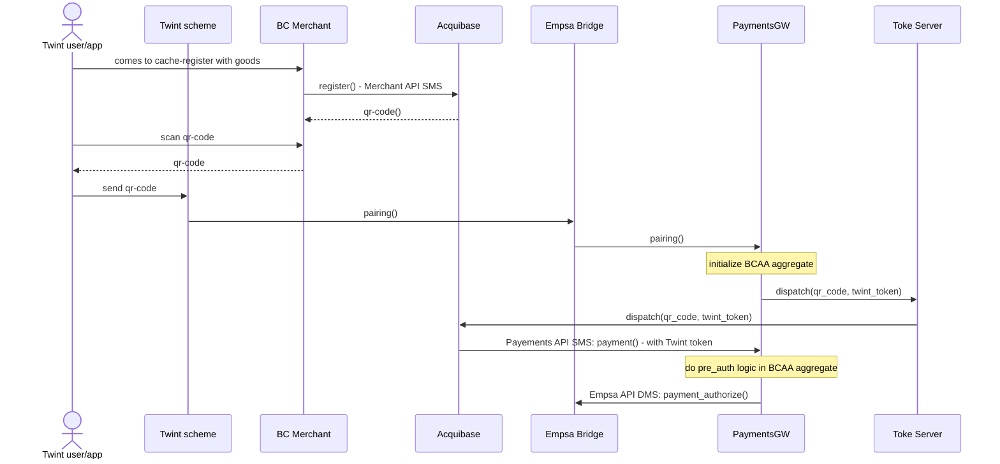

## BCAA consumer-scan (disregarding m2c)

  

```mermaid

sequenceDiagram

  

actor user as Twint user/app

participant tw as Twint scheme

participant merchant as BC Merchant

participant acqui as Acquibase

participant bridge as Empsa Bridge

participant pgw as PaymentsGW

participant ts as Toke Server

  

user->>merchant: comes to cache-register with goods

merchant->>acqui: register() - Merchant API SMS

acqui-->>merchant: qr-code()

user->>merchant: scan qr-code

merchant-->>user: qr-code

user->> tw: send qr-code

tw->>bridge: pairing()

bridge->>pgw: pairing()

Note over pgw: initialize BCAA aggregate

pgw->>ts: dispatch(qr_code, twint_token)

ts->>acqui: dispatch(qr_code, twint_token)

acqui->>pgw: Payements API SMS: payment() - with Twint token

Note over pgw: do pre_auth logic in BCAA aggregate

pgw->>bridge:Empsa API DMS: payment_authorize()

  

```