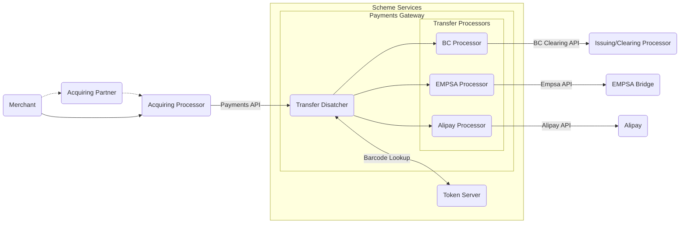
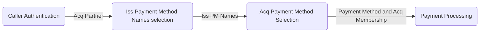

## Payment request flow (high level)

## Payments API
- Caller is Acquiring Processor but
- Caller is authenticated as Acquiring Partner on whose behalf Acquiring Processor is making the call!

### Transfer-initiate request processing
Talking about SMS payment and DMS pre_auth request

#### Caller Authentication
- Simplified version, without Acq Processor (there is only one Acq Processor currently).
- Public key associated with Acquirer (Acq Partner) entity in Acquibase.
- Private key associated with Partner (Acq Partner) entity in PGW

### Issuing Payment Method Name Selection

- PGW asks TS "What are PM names available for this token"?
- TS responds with list of PM names available for provided token (if token is valid).

#### Acquiring Payment Method Selection

- Filter input PM list and keep only PMs that are available to issuer.
- Get all acq_memberships available to acq partner and metch them against acq_memberships offered in PMs list. 
- First matching PM wins.

### Dictionary
- Acq Payment Method consists of:
  -  Acq PM Configuration and 
  -  Acq Membership
- Acq PM Configuration determines:
  - Transfer Processor (ex Payment Processor - Transfer Processor is probably better because that processore processes refunds also).
- Transfer Processor contains list of available schemes.
  - Do we need this? To make sure Alipay acq membership is not used on BC Transfer Processor?
  