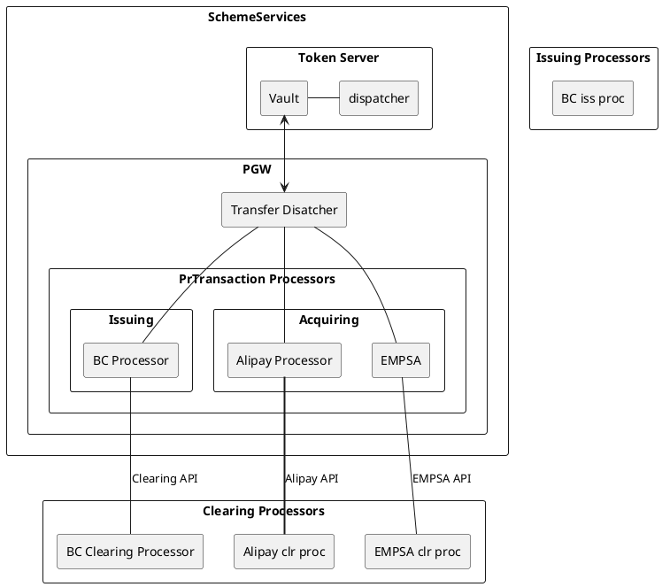

  

```plantuml

@startuml
skinparam componentStyle rectangle

rectangle "SchemeServices" {
  rectangle "Token Server" {
	[dispatcher] -l- [Vault]
  }
	
  rectangle "PGW" {
	  [Transfer Disatcher] as td
		rectangle "PrTransaction Processors" {
		  rectangle "Issuing" {
		    [BC Processor] as bcp
			}
			rectangle "Acquiring" {
        [Alipay Processor] as alipay_tp
			  [EMPSA] as empsa_tp
			}
    }
		
    td <-u-> Vault
		td -r- bcp
		td -- alipay_tp
		td -- empsa_tp
  }
}

rectangle "Issuing Processors" {
  [BC iss proc]
}
rectangle "Clearing Processors" {
  [BC Clearing Processor] as bc_clr
  [Alipay clr proc] as alipay_clr
  [EMPSA clr proc] as e_clr
}

bcp -- bc_clr : Clearing API
alipay_tp == alipay_clr : Alipay API
empsa_tp -- e_clr : EMPSA API


@enduml

```