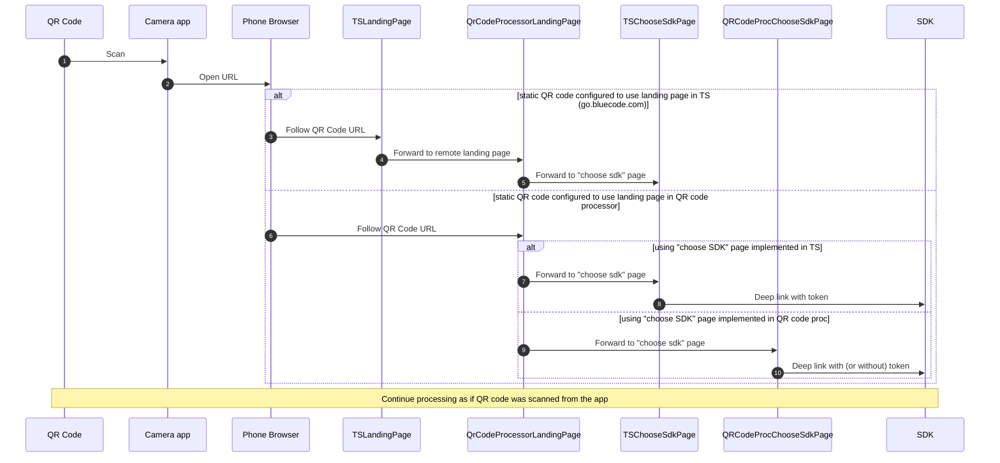
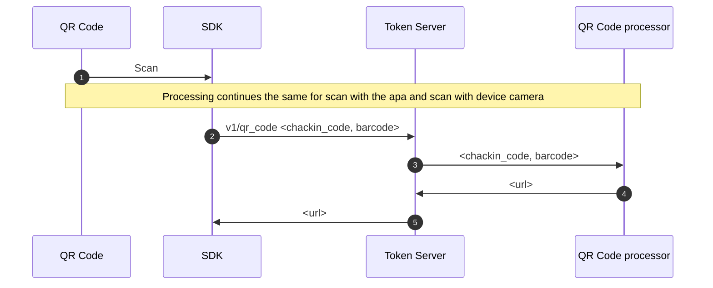
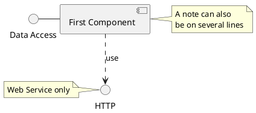

## Scan from camera

```mermaid

sequenceDiagram
autonumber

participant QR Code
participant camera as Camera app
participant Phone Browser
participant TSLandingPage
participant RemoteLandingPage as QrCodeProcessorLandingPage
participant TSChooseSdkPage
participant QRCodeProcChooseSdkPage
participant sdk as SDK

QR Code ->> camera: Scan
camera->>Phone Browser: Open URL
alt static QR code configured to use landing page in TS (go.bluecode.com)
  Phone Browser ->> TSLandingPage: Follow QR Code URL
  TSLandingPage ->> RemoteLandingPage: Forward to remote landing page
  RemoteLandingPage ->> TSChooseSdkPage: Forward to "choose sdk" page
else static QR code configured to use landing page in QR code processor
  Phone Browser ->> RemoteLandingPage: Follow QR Code URL
  alt using "choose SDK" page implemented in TS
	  RemoteLandingPage ->> TSChooseSdkPage: Forward to "choose sdk" page
	  TSChooseSdkPage ->> sdk: Deep link with token
  else using "choose SDK" page implemented in QR code proc
    RemoteLandingPage ->> QRCodeProcChooseSdkPage: Forward to "choose sdk" page
	  QRCodeProcChooseSdkPage ->> sdk: Deep link with (or without) token
  end
end

note over QR Code, sdk: Continue processing as if QR code was scanned from the app
```

## Scan from BC sdk

```mermaid

sequenceDiagram
autonumber

participant QR Code
participant sdk as SDK
participant ts as Token Server
participant qr_proc as QR Code processor

QR Code ->> sdk: Scan
note over QR Code, qr_proc: Processing continues the same for scan with the apa and scan with device camera
sdk->>ts: v1/qr_code <chackin_code, barcode>

ts->>qr_proc: <chackin_code, barcode>
qr_proc->>ts: <url>
ts->>sdk: <url>
```

```plantuml

@startuml
interface "Data Access" as DA
DA - [First Component]
[First Component] ..> HTTP : use
note left of HTTP : Web Service only
note right of [First Component]
A note can also
be on several lines
end note
@enduml

```