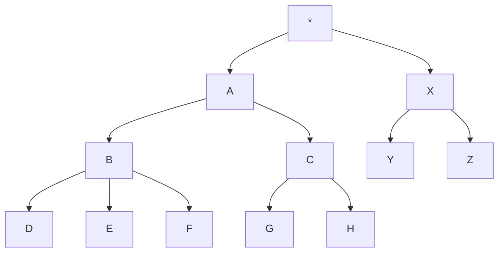
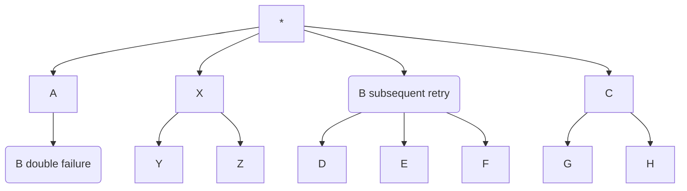

## Problem Context
Event-sourcing requires partial ordering to function properly. How then can we best handle retrying event handlers that have failed?
- blocking retries introduce the risk of propagating performance issues
- event-based retries run the risk of out-of-order processing, which is a problem given event handlers may emit events in an order that depends on state mutations driven by the ordering (since each evant may cause state mutation within the aggregate)

## Assumptions
Every event has a `causation_id` pointing to the event that caused it to exist. Put another way, in the event hander for event A which emits events B and C, both of the events B and C would have `causation_id` values that match event A's event id.

This means that, conceptually, the causality can be modeled as a tree where each edge implies causality:

In keeping with the tree representation, event handling happens breadth first, given the following order of processing: A, X, B, C, Y, Z, D, E, F, G, H

Critically, it means that X can only implicity rely on mutations triggered by A, but NOT by any of its sub-nodes (as those will be processed after X).

## Intuition
Given the causality tree representation, it appears that partial order is required only:
- on each level (i.e. "depth"), given the emitting mechanism in event handlers
- within each sub-tree

This means that if processing of event B failed, the following tree would preserve causality and be an equivalent partial ordering of the events to be processed.

## Application
Let's introduce a conceptual [poison queue](https://learn.microsoft.com/en-us/dotnet/framework/wcf/feature-details/poison-message-handling) for failing events: it's reason to be is to allow for retry semantics while being minimally blocking in regards to the rest of the system.

If an event fails to be processed, it should be retried in a blocking fashion on the assumption that the failure is due to a transient problem withing the system. In other words, it is expected the event handling will succeed on the 2nd attempt.

Should the retry fail (e.g. event "B" above), move the event to the poison queue and continue processing events as follows:
1. if the next event's `causation_id` is different from the poisoned event (e.g. event "X" above), process the event normally
2. if the next event's `causation_id` is the same as the poisoned event (e.g. event "C" above, as both B and C have A as their `causation_id`)
	1. enqueue the event in the poison queue
	2. switch to processing the poison queue (i.e. retry event B, and continue with subsequent events in that poison queue)
	3. after processing the poison queue, return to processing the healthy/main event queue
		- if the events were successfully processed, the poison queue will have drained and can be dropped
		- if the event failed processing again, the queue remains as-is and will be attempted again when a new event from its causality tree comes in
		- if an event *besides the first one* (which is the initially failing event) fails to be processed, a new poison queue is opened (i.e. recursive behavior)

This approach, by being blocking but only for "causally downstream" events would ensure the partial ordering of events (i.e. no out-of-order processing) *for the events where it matters*, while simultaneously keeping event processing chugging along by not blocking the processing of causally-unrelated events.

Naturally, this requires refinement (should poison queue processing depend only on event arrival, should there be a back-off, etc.), but I think there's enough for discussion regarding the high-level idea.