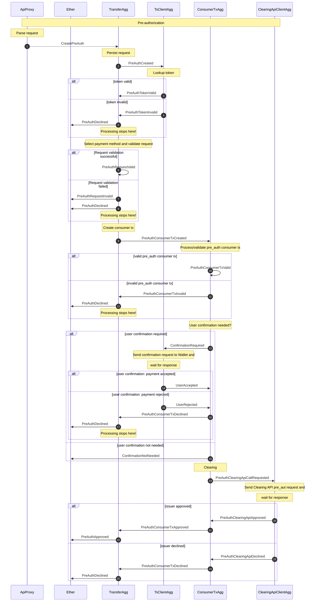

```mermaid

sequenceDiagram

autonumber

participant ApiProxy

participant Ether

  

participant TransferAgg

participant TsClientAgg

participant ConsumerTxAgg

  

participant ClearingApiClientAgg

  

note over ApiProxy, ClearingApiClientAgg: Pre-authorization

  

Note over ApiProxy: Parse request

ApiProxy-->>TransferAgg: CreatePreAuth

Note over TransferAgg: Persist request

TransferAgg->>TsClientAgg: PreAuthCreated

Note over TsClientAgg: Lookup token

alt token valid

TsClientAgg->>TransferAgg: PreAuthTokenValid

else token invalid

TsClientAgg->>TransferAgg: PreAuthTokenInvalid

TransferAgg->>Ether: PreAuthDeclined

Note over TransferAgg: Processing stops here!

end

Note over TransferAgg: Select payment method and validate request

alt Request validation successful

TransferAgg->>TransferAgg: PreAuthRequestValid

else Request validation failed

TransferAgg->>Ether: PreAuthRequestInvalid

TransferAgg->>Ether: PreAuthDeclined

Note over TransferAgg: Processing stops here!

end

Note over TransferAgg: Create consumer tx

TransferAgg->>ConsumerTxAgg: PreAuthConsumerTxCreated

Note over ConsumerTxAgg: Process/validate pre_auth consumer tx

%ConsumerTxAgg->>ConsumerTxAgg: ConsumerTxCreated

  

alt valid pre_auth consumer tx

ConsumerTxAgg->>ConsumerTxAgg: PreAuthConsumerTxValid

else invalid pre_auth consumer tx

ConsumerTxAgg->>TransferAgg: PreAuthConsumerTxInvalid

TransferAgg->>Ether: PreAuthDeclined

Note over TransferAgg: Processing stops here!

end

  

Note over ConsumerTxAgg: User confirmation needed?

alt user confirmation required

ConsumerTxAgg->>TsClientAgg: ConfirmationRequired

%WalletPM->>WalletAgg: RequestConfirmation

Note over TsClientAgg: Send confirmation request to Wallet and

Note over TsClientAgg: wait for response

alt user confirmation: payment accepted

TsClientAgg->>ConsumerTxAgg: UserAccepted

%TransferPM->>TransferAgg: ProcessConfirmation

else user confirmation: payment rejected

TsClientAgg->>ConsumerTxAgg: UserRejected

ConsumerTxAgg->>TransferAgg: PreAuthConsumerTxDeclined

TransferAgg->>Ether: PreAuthDeclined

Note over TransferAgg: Processing stops here!

end

else user confirmation not needed

ConsumerTxAgg->>Ether: ConfirmationNotNeeded

end

Note over ConsumerTxAgg: Clearing

  

ConsumerTxAgg->>ClearingApiClientAgg: PreAuthClearingApiCallRequested

Note over ClearingApiClientAgg: Send Clearing API pre_aut request and

Note over ClearingApiClientAgg: wait for response

  

%ClearingApiClientAgg->>ClearingApiClientAgg: CallClearingApiPreAuth

alt issuer approved

ClearingApiClientAgg->>ConsumerTxAgg: PreAuthClearingApiApproved

ConsumerTxAgg->>TransferAgg: PreAuthConsumerTxApproved

TransferAgg->>Ether: PreAuthApproved

else issuer declined

ClearingApiClientAgg->>ConsumerTxAgg: PreAuthClearingApiDeclined

ConsumerTxAgg->>TransferAgg: PreAuthConsumerTxDeclined

%TransferPM->>TransferAgg: DeclinePreAuth

TransferAgg->>Ether: PreAuthDeclined

end

```