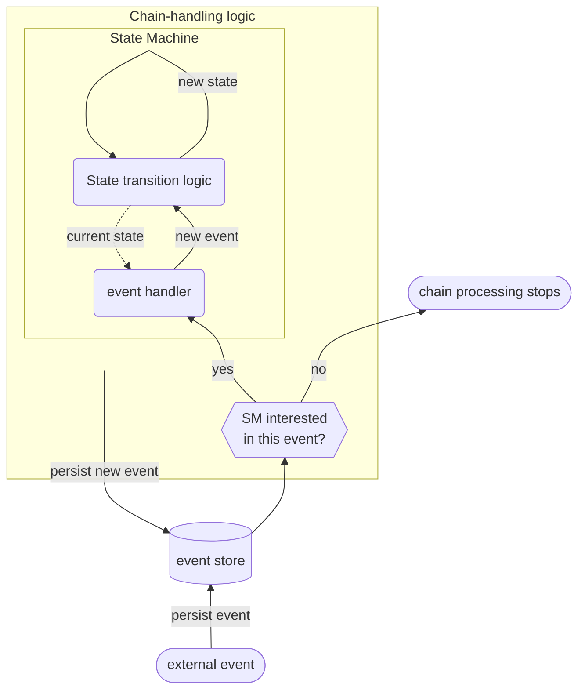
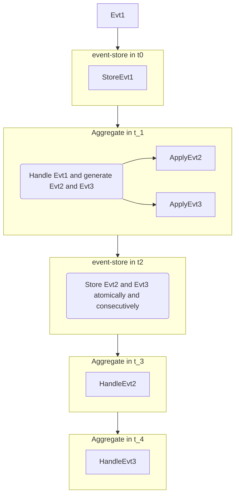

# Evented - State Machine as Sequence of Event Handlers

## Introduction
Evented is event-sourcing library/framework in which operations are represented as chains of retriable steps. Elements of the execution chain are connected and at the same time delimited with events.
Each step is initiated by some event and emits another event as a result of execution. 

## Recursive Nature of Nature
When it comes to causality it is recursive: there is a cause that has an effect, but that effect is in turn cause for some other effect and so on... Can we model code similarly?

If we look at state-machine (SM), input causes SM to (transition to another state and to) generate output. 
That output can be recursively used as SM input.

Can we split an arbitrary algorithm into (one or more) sequences of simple steps, where each sequence is initiated by an external stimulus/input? Why not?
And if we agree that SM inputs and outputs are events, we got Evented. Mechanism conceptually described by the following flowchart: 

## Topics to discuss
### API
- `inject_event/2`
- `inject_event_and_wait/2` 
  - Semantic?
  - Wait for what? Wait for next event with the same correlation_id
- `agg_state/2`
  - Peek at the aggregate state from anywhere.
    - This breaks encapsulation of the aggregate.
  - Do we want this ability at all?
  - Emit event every time somebody wants to look at the aggregate state? 
    - Is it too expensive to be used by default?

### Aggregate
- What is it?
  - Consistency boundary.
  - Execution context (BEAM process within which SM executes).
  - State of the SM.
- How do we think about it?
- What do we use it for?

### Network split resilient?

