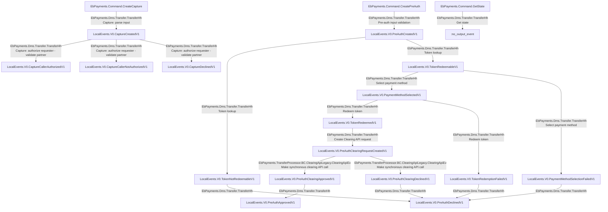

# Evented application EbPayments.Dms.App

  

THIS IS GENERATED FILE

  

!!!!! DO NOT MODIFY !!!!!

  

## List of events:

  

- EbPayments.Command.CreateCapture

- EbPayments.Command.CreatePreAuth

- EbPayments.Command.GetState

- LocalEvents.V0.CaptureCallerAuthorizedV1

- LocalEvents.V0.CaptureCallerNotAuthorizedV1

- LocalEvents.V0.CaptureCreatedV1

- LocalEvents.V0.CaptureDeclinedV1

- LocalEvents.V0.PaymentMethodSelectedV1

- LocalEvents.V0.PaymentMethodSelectionFailedV1

- LocalEvents.V0.PreAuthApprovedV1

- LocalEvents.V0.PreAuthClearingApprovedV1

- LocalEvents.V0.PreAuthClearingDeclinedV1

- LocalEvents.V0.PreAuthClearingRequestCreatedV1

- LocalEvents.V0.PreAuthCreatedV1

- LocalEvents.V0.PreAuthDeclinedV1

- LocalEvents.V0.TokenNotRedeemableV1

- LocalEvents.V0.TokenRedeemableV1

- LocalEvents.V0.TokenRedeemedV1

- LocalEvents.V0.TokenRedemptionFailedV1

- :no_output_event

  

## Event Flowchart

  

