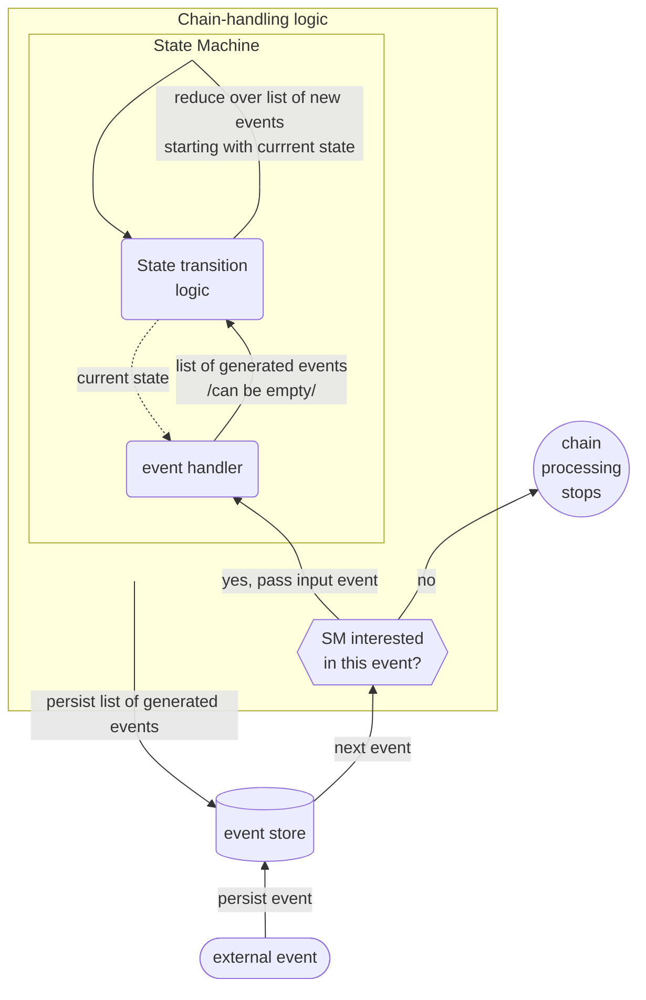

# Evented - State Machine as Sequence of Event Handlers

# Introduction
Evented is event-sourcing library/framework in which operations are represented as chains of retriable steps. Elements of the execution chain are connected and at the same time delimited with events.
Each step is initiated by some event and emits another event as a result of execution. 

# Recursive Nature of Nature
When it comes to causality it is recursive: there is a cause that has an effect, but that effect is in turn cause for some other effect and so on... Can we model code similarly?

If we look at state-machine (SM), input causes SM to (transition to another state and to) generate output. 
That output can be recursively used as SM input.

Can we split an arbitrary algorithm into (one or more) sequences of simple steps, where each sequence is initiated by an external stimulus/input? Why not?
And if we agree that SM inputs and outputs are events, we got Evented. Mechanism conceptually described by the following flowchart: 

# Interacting with Evented system
Evented application is a state machine. In order to interact with it, we need the ability to:
- Introduce new events into the system and
- Query current state of the system.

## Introducing external events into the system
We can choose to "inject" an event through a particular aggregate or just to persist it in event-store.

### Persisting event directly into event-store
This approach allows for a random event to be persisted in event-store unrelated to any aggregate and to any processing. Such event is just there so that it can be used in the future. This is a sound theoretical approach, but in reality random events are rarely (if ever) persisted. Events are injected because they need to be processed in one way or the other. That leads us to "injecting through aggregate" approach.

### Injecting through aggregate
Injecting an event through aggregate enables the aggregate to react to the event (to adjust its state according to the event - `apply/2` function) and only after that to persist the event in event-store in the output stream of the aggregate.
Also, once the event is injected in the event-store through some aggregate, from handling perspective, it is the same as if it was injected directly into the event-store (without previously being handled by the aggregate).
The only characteristics that can be perceived as downside (compared to direct injection) is that if an event is injected through the aggregate, it has to be handled by the aggregate. In reality, it is not a real limitation.

## Querying current state 
State of the system is composition of the states of the aggregates consisting the Evented app. The state of the app is eventually consistent and each of the aggregate's states have to be queried separately, without strong consistency guaranties.
There are several ways to that:
- Directly reading aggregate state and
  - Exposing the state to the outside world.
  - Providing translation layer (between the aggregate state and the caller) which generates state-event.
- "Asking" aggregate to emit state-event into the event-store.
  - Dispatching command to get output-event
  - Injecting request-event through the aggregate in order to instruct it to emit state-event.

### Encapsulation
First option, "exposing state to the outside world", is technically speaking fastest (least overhead) but also dirtiest, since it requires coupling between internal representation of the state and the outside world.
The remaining three options provide clean separation between internal representation of the aggregate state and the code outside the aggregate.

### Synchronization
Aggregates are mutually eventually consistent, so ordering between events coming from different aggregates cannot be established.

It might be possible to establish ordering between events coming out of a single aggregate, depending on why are those events created (what initiated the logic/code resulting in the event).
If a state-event is generated based on the state of "directly read" aggregate,  it is not possible to establish ordering between the state-event and processing-events.

In contrast to that, if a state-event generation operation is serialized on the aggregate the same as all other event-processing operations are, then there are some guaranties. If state-event generation operation is initiated after event-injection operation (assuming that event is injected through aggregate), then state-event will contain consequences of the injected event processing.
For example, if:
- the consequence of event-injection is creation of new payment aggregate and 
- injection is performed through aggregate (not directly in event-store) and 
- state-event generation operation is serialized on the aggregate (the same as event processing operations are), 
then there is a guarantee that generated state-event will report payment as "created".

# Topics to discuss
## API
- `inject_event/2`
- `inject_event_and_wait/2` 
  - Semantic?
  - Wait for what? Wait for next event with the same correlation_id
- `agg_state/2`
  - Peek at the aggregate state from anywhere.
    - This breaks encapsulation of the aggregate.
  - Do we want this ability at all?
  - Emit event every time somebody wants to look at the aggregate state? 
    - Is it too expensive to be used by default?

## Stateful Handler 
- Returns a list.
  - I find 
  - What if we do not think of it as a system/design decision but as "what can system do to make my life easier?" 

## Aggregate
- What is it?
- How do we think about it?
- What do we use it for?

# Events and commands
Traditionally there is clear differentiation between commands and events. Commands represent the intention to do something. Events represent the fact (that something happened) in the past.
So, there is obvious causal relationship between a command and event (or set of events) generated because of the command. If we move a step back and look at the bigger picture, there is also causal relationship between event and command – something caused command to be dispatched (that something is event in even-sourcing context of the word if it is persisted in event-store or event in broad meaning of the word.
There is recursive causal relationship between commands and events: command causes event and that event in turn causes some other command which causes next event and so on…

## Handling of Events and Commands

Only the events are (ever) lasting. Commands are volatile ???? (continue)

# Concept
We decided to abstract away command part totally from the model available to the user and ???(to be continued...)

## Evented
